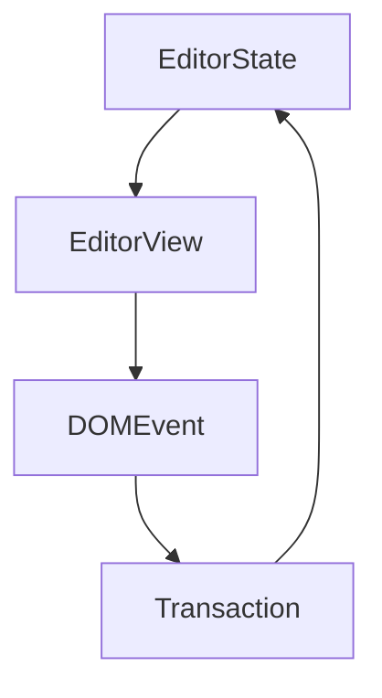

# doclea

> Milkdown is a WYSIWYG markdown editor framework.
>
> :baby_bottle: Here is the [repo] (right click to open link). \
> We ~~only support commonmark~~. GFM is also supported!

You can check the output markdown text in **two columns editing**.

- Features
  - [x] 📝 **WYSIWYG Markdown** - Write markdown in an elegant way
  - [x] 🎨 **Themable** - Theme can be shared and used with npm packages
  - [x] 🎮 **Hackable** - Support your awesome idea by plugin
  - [x] 🦾 **Reliable** - Built on top of [prosemirror] and [remark]
  - [x] ⚡ **Slash & Tooltip** - Write fast for everyone, driven by plugin
  - [x] 🧮 **Math** - LaTeX math equations support, driven by plugin
  - [x] 📊 **Table** - Table support with fluent ui, driven by plugin
  - [x] 📰 **Diagram** - Diagram support with [mermaid](https://mermaid-js.github.io/mermaid/#/), driven by plugin
  - [x] 🍻 **Collaborate** - Shared editing support with [yjs], driven by plugin
  - [x] 💾 **Clipboard** - Support copy and paste markdown, driven by plugin
  - [x] :+1: **Emoji** - Support emoji shortcut and picker, driven by plugin
- Made by
  - Programmer: [Mirone][mirone]
  - Designer: [Meo][meo]

---

You can add `inline code` and code block:

```javascript
function main() {
  console.log('Hello milkdown!')
}
```

> Tips: use `Mod-Enter` to exit blocks such as code block.

---

You can type `||` and a `space` to create a table:

| First Header   |   Second Header    |
| -------------- | :----------------: |
| Content Cell 1 |  `Content` Cell 1  |
| Content Cell 2 | **Content** Cell 2 |

---

Math is supported by [TeX expression](https://en.wikipedia.org/wiki/TeX).

Now we have some inline math: $E = mc^2$. You can click to edit it.

Math block is also supported.

$$
\begin{aligned}
T( (v_1 + v_2) \otimes w) &= T(v_1 \otimes w) + T(v_2 \otimes w) \\
T( v \otimes (w_1 + w_2)) &= T(v \otimes w_1) + T(v \otimes w_2) \\
T( (\alpha v) \otimes w ) &= T( \alpha ( v \otimes w) ) \\
T( v \otimes (\alpha w) ) &= T( \alpha ( v \otimes w) ) \\
\end{aligned}
$$

You can type `$$` and a `space` to create a math block.

---

Use [emoji cheat sheet](https://www.webfx.com/tools/emoji-cheat-sheet/) such as `:+1:` to add emoji.

You may notice the emoji filter while inputting values, try to type `:baby` to see the list.

You can also type `:emoji:` to toggle the emoji picker.

---

Diagrams is powered by [mermaid](https://mermaid-js.github.io/mermaid/#/).

You can type ` ```mermaid ` to add diagrams.



---

Have fun!

[repo]: https://github.com/Saul-Mirone/milkdown
[prosemirror]: https://prosemirror.net/
[yjs]: https://docs.yjs.dev/
[remark]: https://github.com/remarkjs/remark
[mirone]: https://github.com/Saul-Mirone
[meo]: https://www.meo.cool/

![fdfd](data:image/svg+xml;base64,PHN2Zw0KICB4bWxucz0iaHR0cDovL3d3dy53My5vcmcvMjAwMC9zdmciDQogIHZpZXdCb3g9IjAgMCAxMDYgMjY1Ig0KICB3aWR0aD0iNzQiDQogIGhlaWdodD0iMjMzIg0KICBmaWxsPSJ0cmFuc3BhcmVudCINCj4NCiAgPGRlZnM+DQogICAgPHN0eWxlPg0KICAgICAgQGltcG9ydCB1cmwoImh0dHBzOi8vZm9udHMuZ29vZ2xlYXBpcy5jb20vY3NzMj9mYW1pbHk9Q2F2ZWF0K0JydXNoJmFtcDtmYW1pbHk9U291cmNlK0NvZGUrUHJvJmFtcDtmYW1pbHk9U291cmNlK1NhbnMrUHJvJmFtcDtmYW1pbHk9Q3JpbXNvbitQcm8mYW1wO2Rpc3BsYXk9YmxvY2siKTsNCiAgICA8L3N0eWxlPg0KICA8L2RlZnM+DQogIDxnDQogICAgaWQ9IjJlYjhkNWE2LTNhZDctNDc3YS0zYzg5LTdlN2EzYWE2Yjg3Yl9zdmciDQogICAgY2xhc3M9InRsLWNlbnRlcmVkLWciDQogICAgdHJhbnNmb3JtPSJ0cmFuc2xhdGUoMzQsIDE2KSByb3RhdGUoMCwgMTEuNSwgMjApIg0KICA+DQogICAgPGcgb3BhY2l0eT0iMSI+DQogICAgICA8cGF0aA0KICAgICAgICBkPSJNIDIuMDQsLTEuMzYgUSAyLjA0LC0xLjM2IDMuMjQsMC43NCA0LjQ0LDIuODUgNS4zNSw1LjA1IDYuMjcsNy4yNCA3LjE0LDkuMDIgOC4wMSwxMC44MSA4LjY0LDEyLjA1IDkuMjcsMTMuMjggMTAuNTMsMTUuMTYgMTEuNzksMTcuMDMgMTIuNjMsMTguMzMgMTMuNDcsMTkuNjMgMTQuNDgsMjEuMzcgMTUuNDksMjMuMTIgMTYuNzUsMjUuMDEgMTguMDEsMjYuOTAgMTkuMjQsMjguMjcgMjAuNDgsMjkuNjMgMjEuNjQsMzEuMTYgMjIuODEsMzIuNjkgMjMuNTQsMzQuMjcgMjQuMjgsMzUuODUgMjQuOTUsMzcuNDEgMjUuNjIsMzguOTcgMjUuNzEsMzkuNDEgMjUuODEsMzkuODYgMjUuNzUsNDAuMzEgMjUuNzAsNDAuNzYgMjUuNTEsNDEuMTggMjUuMzEsNDEuNTkgMjUuMDAsNDEuOTIgMjQuNjgsNDIuMjUgMjQuMjgsNDIuNDYgMjMuODgsNDIuNjcgMjMuNDMsNDIuNzQgMjIuOTgsNDIuODEgMjIuNTMsNDIuNzMgMjIuMDgsNDIuNjYgMjEuNjgsNDIuNDQgMjEuMjgsNDIuMjIgMjAuOTcsNDEuODkgMjAuNjYsNDEuNTYgMjAuNDcsNDEuMTQgMjAuMjgsNDAuNzMgMjAuMjMsNDAuMjggMjAuMTksMzkuODMgMjAuMjksMzkuMzggMjAuMzksMzguOTQgMjAuNjMsMzguNTUgMjAuODYsMzguMTYgMjEuMjEsMzcuODcgMjEuNTYsMzcuNTggMjEuOTgsMzcuNDEgMjIuNDEsMzcuMjQgMjIuODYsMzcuMjIgMjMuMzIsMzcuMjAgMjMuNzUsMzcuMzIgMjQuMTksMzcuNDUgMjQuNTcsMzcuNzEgMjQuOTQsMzcuOTYgMjUuMjIsMzguMzMgMjUuNDksMzguNjkgMjUuNjMsMzkuMTMgMjUuNzcsMzkuNTYgMjUuNzcsNDAuMDEgMjUuNzcsNDAuNDcgMjUuNjIsNDAuOTAgMjUuNDcsNDEuMzMgMjUuMTksNDEuNjkgMjQuOTIsNDIuMDUgMjQuNTQsNDIuMzAgMjQuMTYsNDIuNTYgMjMuNzIsNDIuNjcgMjMuMjgsNDIuNzkgMjIuODMsNDIuNzcgMjIuMzcsNDIuNzQgMjEuOTUsNDIuNTcgMjEuNTMsNDIuNDAgMjEuMTgsNDIuMTAgMjAuODQsNDEuODAgMjAuNjEsNDEuNDEgMjAuMzcsNDEuMDIgMjAuMzcsNDEuMDIgMjAuMzcsNDEuMDIgMTkuNDgsMzguNTAgMTguNTgsMzUuOTcgMTcuNTksMzQuNTIgMTYuNTksMzMuMDcgMTUuMzIsMzEuNTAgMTQuMDUsMjkuOTMgMTMuMTUsMjguNzcgMTIuMjUsMjcuNjAgMTEuMTgsMjUuMjUgMTAuMTAsMjIuOTAgOS41OSwyMS42OSA5LjA4LDIwLjQ3IDguMzQsMTguODggNy42MCwxNy4yOCA2LjM3LDE0Ljg0IDUuMTQsMTIuMzkgNC4wNCwxMC42MSAyLjk1LDguODQgMS45NCw3LjAxIDAuOTIsNS4xOSAtMC41NSwzLjI3IC0yLjA0LDEuMzYgLTIuMTcsMS4wOSAtMi4zMSwwLjgzIC0yLjM3LDAuNTQgLTIuNDQsMC4yNSAtMi40NCwtMC4wMyAtMi40MywtMC4zMyAtMi4zNSwtMC42MiAtMi4yOCwtMC45MCAtMi4xNCwtMS4xNiAtMi4wMCwtMS40MiAtMS44MCwtMS42NCAtMS42MCwtMS44NiAtMS4zNSwtMi4wMyAtMS4xMCwtMi4xOSAtMC44MiwtMi4yOSAtMC41NCwtMi4zOSAtMC4yNSwtMi40MiAwLjAzLC0yLjQ1IDAuMzMsLTIuNDEgMC42MiwtMi4zNyAwLjkwLC0yLjI2IDEuMTcsLTIuMTUgMS40MSwtMS45OCAxLjY1LC0xLjgxIDEuODUsLTEuNTggWiINCiAgICAgICAgZmlsbD0iIzFkMWQxZCINCiAgICAgICAgc3Ryb2tlPSIjMWQxZDFkIg0KICAgICAgICBzdHJva2Utd2lkdGg9IjEiDQogICAgICAgIHN0cm9rZS1saW5lam9pbj0icm91bmQiDQogICAgICAgIHN0cm9rZS1saW5lY2FwPSJyb3VuZCINCiAgICAgICAgcG9pbnRlci1ldmVudHM9Im5vbmUiDQogICAgICAvPg0KICAgIDwvZz4NCiAgPC9nPg0KICA8ZyB0cmFuc2Zvcm09InRyYW5zbGF0ZSgxNiwgMTg2KSByb3RhdGUoMCwgMzcsIDMxLjUpIj4NCiAgICA8ZyBpZD0iOGQxOWY2NDUtMTg5MC00MmEwLTMzZTctYjQ2ZTU5OWZlNDQxX3N2ZyIgY2xhc3M9InRsLWNlbnRlcmVkLWciPg0KICAgICAgPHBhdGgNCiAgICAgICAgZD0iTSA3NC41NSw0My4xNyBRIDc0LjU1LDQzLjE3IDc0LjY3LDQ2LjAxIDc0LjgwLDQ4Ljg1IDc0LjkyLDUyLjQ5IDc1LjA0LDU2LjEyIDczLjI2LDU5LjAzIDcxLjQ4LDYxLjkzIDY3LjMzLDYyLjcxIDYzLjE3LDYzLjQ5IDU4LjczLDYzLjU3IDU0LjI4LDYzLjY1IDQ5Ljc2LDYzLjYwIDQ1LjI0LDYzLjU2IDQwLjcwLDYzLjU4IDM2LjE2LDYzLjU5IDMxLjYxLDYzLjcwIDI3LjA2LDYzLjgwIDIyLjUxLDYzLjkwIDE3Ljk2LDY0LjAxIDEzLjM2LDY0LjA5IDguNzUsNjQuMTggNS42MSw2Mi40MiAyLjQ4LDYwLjY2IDEuNTksNTcuMDMgMC43MCw1My40MSAwLjU2LDQ5LjYxIDAuNDIsNDUuODAgMC40Miw0MS45NyAwLjQyLDM4LjE1IDAuMzYsMzQuMzEgMC4zMCwzMC40OCAwLjE2LDI2LjY0IDAuMDEsMjIuODAgLTAuMTIsMTguOTYgLTAuMjYsMTUuMTIgLTAuMzgsMTEuMjIgLTAuNTEsNy4zMSAxLjI3LDQuMzQgMy4wNSwxLjM2IDcuMjAsMC41OCAxMS4zNiwtMC4xOCAxNS44MCwtMC4yNCAyMC4yNSwtMC4zMCAyNC43NywtMC4yNCAyOS4yOSwtMC4xNyAzMy44MywtMC4xNiAzOC4zNywtMC4xNSA0Mi45MiwtMC4yMyA0Ny40NywtMC4zMSA1Mi4wMiwtMC4zOCA1Ni41NywtMC40NiA2MS4xOCwtMC41MiA2NS43OCwtMC41OCA2OC45MSwxLjE4IDcyLjA1LDIuOTQgNzIuOTQsNi41NSA3My44MywxMC4xNSA3My45NywxMy45NCA3NC4xMSwxNy43MiA3NC4xMSwyMS41MiA3NC4xMCwyNS4zMiA3NC4xNiwyOS4xMyA3NC4yMiwzMi45NCA3NC4zNywzNi43NSA3NC41MSw0MC41NiA3NC42Nyw0NS42OCA3NC44Myw1MC44MCA3NC43OSw1MS4wMyA3NC43Niw1MS4yNyA3NC42NSw1MS40OCA3NC41NCw1MS42OSA3NC4zNyw1MS44NSA3NC4yMCw1Mi4wMiA3My45OSw1Mi4xMiA3My43Nyw1Mi4yMiA3My41NCw1Mi4yNSA3My4zMCw1Mi4yOCA3My4wNyw1Mi4yMyA3Mi44NCw1Mi4xOSA3Mi42Myw1Mi4wNyA3Mi40Myw1MS45NSA3Mi4yNyw1MS43NyA3Mi4xMiw1MS41OSA3Mi4wMyw1MS4zNyA3MS45NCw1MS4xNSA3MS45Miw1MC45MSA3MS45MSw1MC42OCA3MS45Nyw1MC40NSA3Mi4wMyw1MC4yMiA3Mi4xNiw1MC4wMiA3Mi4yOSw0OS44MiA3Mi40Nyw0OS42OCA3Mi42Niw0OS41MyA3Mi44OCw0OS40NSA3My4xMSw0OS4zOCA3My4zNSw0OS4zNyA3My41OCw0OS4zNyA3My44MSw0OS40NCA3NC4wMyw0OS41MiA3NC4yMiw0OS42NiA3NC40MSw0OS44MCA3NC41NSw0OS45OSA3NC42OCw1MC4xOSA3NC43NSw1MC40MSA3NC44Miw1MC42NCA3NC44MSw1MC44OCA3NC44MCw1MS4xMiA3NC43MSw1MS4zNCA3NC42Myw1MS41NiA3NC40OCw1MS43NCA3NC4zMyw1MS45MiA3NC4xMiw1Mi4wNSA3My45Miw1Mi4xNyA3My42OSw1Mi4yMyA3My40Niw1Mi4yOCA3My4yMyw1Mi4yNiA3Mi45OSw1Mi4yMyA3Mi43Nyw1Mi4xNCA3Mi41Niw1Mi4wNCA3Mi4zOCw1MS44OCA3Mi4yMSw1MS43MiA3Mi4xMCw1MS41MSA3MS45OCw1MS4zMCA3MS45NCw1MS4wNyA3MS45MCw1MC44NCA3MS45MCw1MC44NCA3MS45MCw1MC44NCA3MS45Myw0NS43MiA3MS45NSw0MC42MCA3Mi4wMCwzNi43OCA3Mi4wNCwzMi45NyA3MS45OCwyOS4xNyA3MS45MiwyNS4zNyA3MS43NCwyMS42MiA3MS41NSwxNy44NyA3MS4yNiwxNC4zMiA3MC45NiwxMC43OCA3MC40Myw3Ljk0IDY5LjkwLDUuMTAgNjcuNzMsMy44OCA2NS41NiwyLjY1IDYxLjA2LDIuNTYgNTYuNTYsMi40NiA1Mi4wMSwyLjM1IDQ3LjQ2LDIuMjQgNDIuOTIsMi4xMyAzOC4zNywyLjAyIDMzLjgzLDIuMDIgMjkuMzAsMi4wMSAyNC44MiwyLjEzIDIwLjM0LDIuMjQgMTYuMDgsMi40NyAxMS44MiwyLjcwIDguNDQsMy4xNSA1LjA2LDMuNjEgMy44OSw1LjU3IDIuNzEsNy41MyAyLjY5LDExLjMxIDIuNjYsMTUuMDkgMi42MiwxOC45MyAyLjU3LDIyLjc3IDIuNTMsMjYuNjEgMi40OSwzMC40NCAyLjU1LDM0LjI3IDIuNjAsMzguMTAgMi43OSw0MS44NyAyLjk3LDQ1LjY1IDMuMjcsNDkuMjIgMy41Niw1Mi43OSA0LjA5LDU1LjY1IDQuNjMsNTguNTEgNi43OSw1OS43MiA4Ljk1LDYwLjkzIDEzLjQ1LDYxLjAxIDE3Ljk1LDYxLjA4IDIyLjUwLDYxLjE2IDI3LjA1LDYxLjI0IDMxLjYwLDYxLjMzIDM2LjE1LDYxLjQxIDQwLjY4LDYxLjM5IDQ1LjIyLDYxLjM3IDQ5LjcwLDYxLjIzIDU0LjE4LDYxLjA5IDU4LjQ0LDYwLjg0IDYyLjcwLDYwLjYwIDY2LjA4LDYwLjE0IDY5LjQ2LDU5LjY4IDcwLjY0LDU3Ljc4IDcxLjgyLDU1Ljg5IDcxLjg1LDUyLjM5IDcxLjg3LDQ4Ljg5IDcxLjkzLDQ2LjA1IDcxLjk5LDQzLjIxIDcyLjAxLDQzLjA1IDcyLjAyLDQyLjkwIDcyLjA3LDQyLjc1IDcyLjEzLDQyLjYxIDcyLjIxLDQyLjQ4IDcyLjMwLDQyLjM1IDcyLjQxLDQyLjI1IDcyLjUzLDQyLjE1IDcyLjY2LDQyLjA3IDcyLjgwLDQyLjAwIDcyLjk1LDQxLjk2IDczLjEwLDQxLjkyIDczLjI1LDQxLjkyIDczLjQxLDQxLjkyIDczLjU2LDQxLjk1IDczLjcxLDQxLjk5IDczLjg0LDQyLjA2IDczLjk4LDQyLjEzIDc0LjEwLDQyLjIzIDc0LjIxLDQyLjMzIDc0LjMwLDQyLjQ2IDc0LjM5LDQyLjU4IDc0LjQ1LDQyLjcyIDc0LjUwLDQyLjg3IDc0LjUzLDQzLjAyIFoiDQogICAgICAgIGZpbGw9IiMxZDFkMWQiDQogICAgICAgIHN0cm9rZT0iIzFkMWQxZCINCiAgICAgICAgc3Ryb2tlLXdpZHRoPSIyIg0KICAgICAgICBwb2ludGVyLWV2ZW50cz0ibm9uZSINCiAgICAgIC8+DQogICAgPC9nPg0KICAgIDxnDQogICAgICBmb250LXNpemU9IjI4Ig0KICAgICAgZm9udC1mYW1pbHk9IkNhdmVhdCBCcnVzaCINCiAgICAgIHRleHQtYWxpZ249ImxlZnQiDQogICAgICBmaWxsPSIjMWQxZDFkIg0KICAgICAgdHJhbnNmb3JtLW9yaWdpbj0idG9wIGxlZnQiDQogICAgICB0cmFuc2Zvcm09InRyYW5zbGF0ZSgyOSwgMTUuNSkiDQogICAgPg0KICAgICAgPHRleHQgeT0iMTguMiIgLz4NCiAgICA8L2c+DQogIDwvZz4NCjwvc3ZnPg0K)
